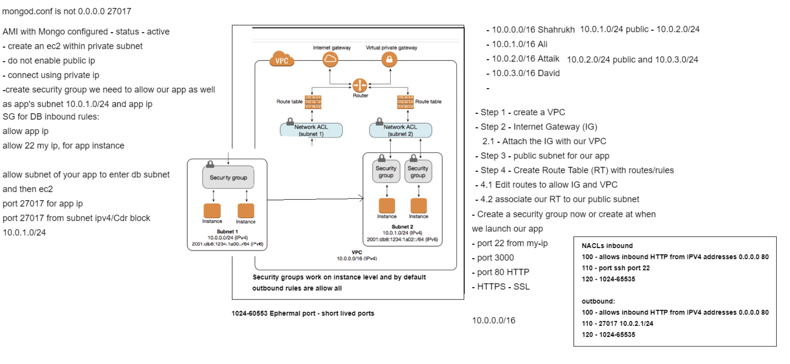
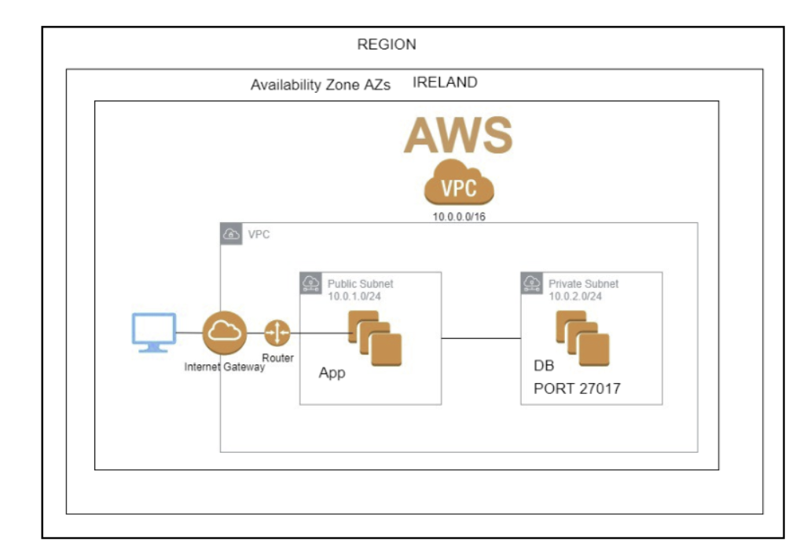

# AWS Networking
## VPC
### 2Tier Architecture Deployment

**AWS Networking**

- IP address
- CIDR block
- IPv4 and IPv6

**VPC and its resources**
- 
- Route table rules
- SG rules
- Subnet cidr blocks
- Connectivity between app and app nat db

**2 Tier Architecture Deployment in your own VPC**

- Should have all rules at all levels required

